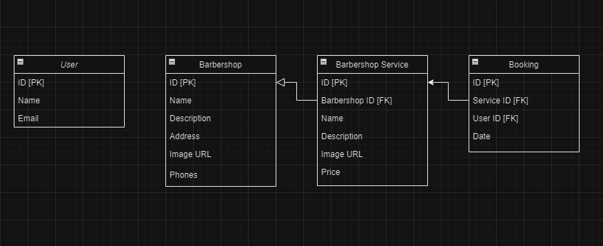

## SISTEMA DE AGENDAMENTO PARA BARBEARIAS

<h3> IMPORTANTE !! -> Aplicação em construção para telas maiores</h3>

<h4>No momento, a aplicação foi feita para mobile, em fase de construção para telas maiores</h4>


## Tecnologias Utilizadas:

- **Next.js**
- **Typescript**
- **Node.js**
- **Prisma**
- **PostgreSQL**
- **TailwindCSS**
- **Shadcn.ui**


## Diagrama do Banco de Dados




## Deploy feito na Vercel


```js
------------------------------------------------ FUNCIONALIDADES ------------------------------------------------

Para rodar o projeto em sua máquina, é preciso:

-instalar todas dependências no seu código com npm install
-rodar servidor com npm run dev


CRUD -> O Projeto ESTÁ FAZENDO:

-Criação de barbearias;
-Criação de serviços das barbearias;
-Login de usuários com Google;
-Criação de agendamentos pelos usuários logados;
-Leitura de agendamentos do usuário;
-Deleção de agendamentos.

```
